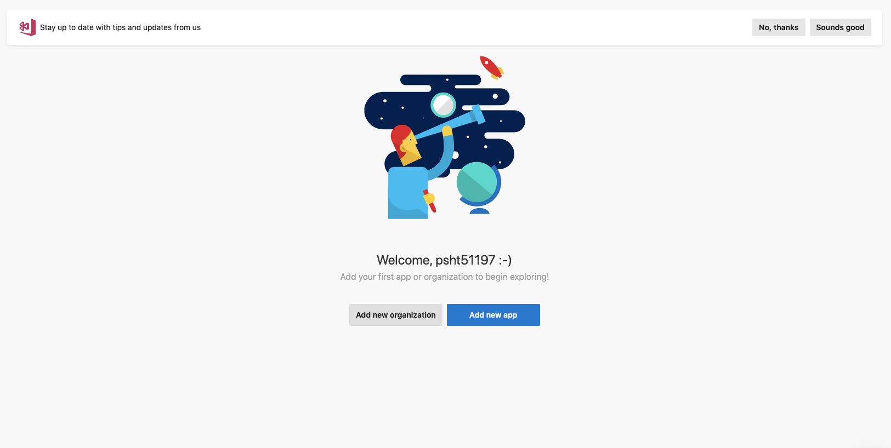

# CICD Document

## 1. Điều kiện :

- Phiên bản **React Native** đang dùng phải từ 0.34 trở lên
- Thiết bị sử dụng :
  - Android :
    - Version 4.1.
    - API level từ 12 trở lên.
  - IOS :
    - Version 9.0 trở lên.
- Không sử dụng thư viện hổ trợ báo cáo sự cố ( **Crash Reporting** ) trên IOS.
- Trên IOS, Sử dụng [CocoaPods](https://cocoapods.org/). Tham khảo thêm tại [ CocoaPods Getting Started ](https://guides.cocoapods.org/using/getting-started.html)

## 2. Sử dụng:

- Truy cập [appcenter.ms](https://appcenter.ms). Đăng kí tài khảon và đăng nhập

  Sau khi đăng kí, đăng nhập, Chọn Add New App

  
